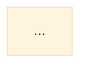

Create visual diagrams from documentation or requirements, then export to PNG.

## Usage

- `/mermaid <source> ["prompt"]` - Generate a diagram from source file(s)
- `/mermaid <source> ["prompt"] --png` - Generate diagram and export to PNG
- `/mermaid <diagram-file> --png-only` - Export existing diagram to PNG

**Source can be:**

- A single file: `docs/plan.md`
- Multiple files: `docs/plan.md,src/handlers/*.py`
- A directory: `src/` (reads relevant files)
- A glob pattern: `**/*_handler.py`

## Config Files

Theme configs are bundled with this skill at
`~/projects/setup/linked/claude/skills/mermaid/`:

- `puppeteer-config.json` - Chrome path for rendering
- `mermaid-config.json` - Theme and spacing settings
- `mermaid.css` - Branding styles

Use these paths directly in the mmdc command (no per-project setup needed).

## Workflow

### 1. Create the diagram

**File format:** When writing a `.md` file, always wrap the diagram in a mermaid
code fence so `mmdc` can find it:

````

````

**Mermaid init block (minimal - config file handles settings):**

```
%%{init: {'theme': 'base'}}%%
```

The bundled `mermaid-config.json` handles theme variables, padding, and spacing.
Keep the init block minimal to avoid conflicts.

**Theme Colors:**

| Element   | Fill    | Stroke  | Text    | Usage                           |
| --------- | ------- | ------- | ------- | ------------------------------- |
| Start/End | #36164a | #36164a | #fff    | Entry/exit points (dark purple) |
| Decisions | #ffde00 | #36164a | #36164a | Customer choices (yellow)       |
| Actions   | #FF4623 | #36164a | #fff    | Bot responses (red-orange)      |
| Verified  | #00e3ff | #36164a | #36164a | Success states (cyan)           |

**IMPORTANT:**

- Don't use green backgrounds
- Use cyan `#00e3ff` for success states instead

**Class definitions (copy exactly):**

```
classDef startEnd fill:#36164a,stroke:#36164a,stroke-width:2px,color:#fff
classDef decision fill:#ffde00,stroke:#36164a,stroke-width:2px,color:#36164a
classDef action fill:#FF4623,stroke:#36164a,stroke-width:2px,color:#fff
classDef verified fill:#00e3ff,stroke:#36164a,stroke-width:2px,color:#36164a
```

**Icons - use Unicode emoji (Font Awesome doesn't render):**

- 💬 Customer message
- 🔍 Search/lookup
- 🤖 Bot responses
- 👆 Customer taps
- ⌨️ Customer types
- ✅ Verification complete
- 💾 Log/save
- 📤 Send
- ⏰ Timer

**Node shapes:**

- `([text])` - Stadium/pill shape (preferred for actions)
- `{text}` - Diamond (decisions)
- `<br/>` for line breaks

### 2. Export to PNG

```bash
mmdc -i <diagram.md> -o <diagram.png> -s 3 -b white \
  -p ~/projects/setup/linked/claude/skills/mermaid/puppeteer-config.json \
  -C ~/projects/setup/linked/claude/skills/mermaid/mermaid.css \
  -c ~/projects/setup/linked/claude/skills/mermaid/mermaid-config.json
```

Then rename if needed:

```bash
mv -n <diagram>-1.png <diagram>.png
```

**Key flags:**

- `-s 3` - Scale 3x for crisp text without excessive file size
- `-c` - Config with theme and spacing settings

### 3. Report results

- Confirm diagram file location and PNG size
- VS Code preview: `Cmd+Shift+V` (needs "Markdown Preview Mermaid Support"
  extension)

## Tips

1. **Let text breathe** - Don't over-abbreviate; let nodes size to fit
2. **Don't mess with padding** - Let mermaid handle node sizing
3. **Use subgraphs** - Group related nodes (white background, purple border)
4. **Label edges** - Keep short; they have white background for contrast
5. **Direction** - `TD` (top-down) for flows, `LR` for timelines

## Reference

Additional mermaid class definitions:

```
classDef info fill:#f6ebff,stroke:#9400ff,stroke-width:2px,color:#36164a
classDef warning fill:#fff9db,stroke:#ffd43b,stroke-width:2px,color:#36164a
classDef critical fill:#fff5f5,stroke:#ff8787,stroke-width:2px,color:#36164a
classDef leaf fill:#1ae570,stroke:#36164a,stroke-width:2px,color:#36164a
classDef flash fill:#ff83ff,stroke:#36164a,stroke-width:2px,color:#36164a
```
